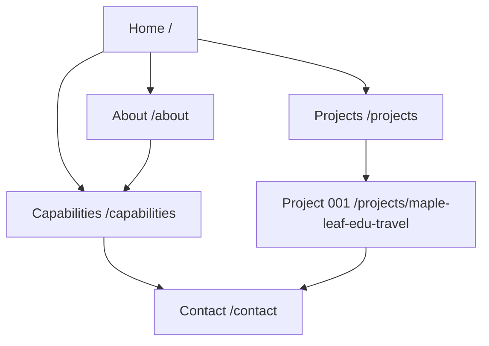

# Laicai OS Website V0.2 — Information Architecture

Status: Planning

Branch: `agent/v0.2-information-architecture`

Production baseline: `main` at `af6e1c4`

## 1. V0.2 objective

V0.2 evolves the current single-page brand foundation into a six-page website that explains what Laicai OS is, how it works, what it can do, and how its first project validates the system.

The release should help a new visitor answer five questions in order:

1. What is Laicai OS?
2. Who is it for?
3. What capabilities does it provide?
4. Is there evidence that the system works?
5. How can I start a conversation?

V0.2 remains a brand and validation website. It is not yet a customer dashboard, SaaS application, knowledge base, or self-service purchasing flow.

## 2. Primary audiences

| Audience | Main question | Desired action |
| --- | --- | --- |
| Founders and business leaders | Can Laicai OS turn strategy into repeatable growth? | Explore capabilities, then contact |
| Brand and content teams | Can it connect fragmented content, knowledge, and workflows? | Review the operating model |
| Potential partners | Is Laicai OS credible and suitable for collaboration? | Review Project 001, then contact |
| Future team members and collaborators | What is being built and why does it matter? | Understand the thesis and start a conversation |

## 3. Core message hierarchy

**Category:** AI operating system for organizations.

**Promise:** Build brands. Operate growth. Learn continuously.

**Difference:** Laicai OS connects strategy, content, knowledge, data, and automation rather than acting as another isolated AI tool.

**Proof:** Project 001 applies the operating system to incubate Maple Leaf Edu Travel as an international K12 education brand.

**Action:** Start a conversation about building or operating the next project.

## 4. Route map

| Page | Route | Purpose | Primary CTA |
| --- | --- | --- | --- |
| Home | `/` | Communicate the entire proposition quickly and route visitors to deeper pages | Explore Project 001 |
| About | `/about` | Explain the thesis, principles, target users, and long-term vision | Explore capabilities |
| Capabilities | `/capabilities` | Explain the four connected operating capabilities and the growth flywheel | Discuss a use case |
| Projects | `/projects` | Introduce the project system and provide an index of current and future projects | View Project 001 |
| Project 001 | `/projects/maple-leaf-edu-travel` | Present the first incubation case, method, progress, and evidence | Discuss a project |
| Contact | `/contact` | Convert qualified interest into a structured conversation | Send inquiry |

## 5. Global navigation

Desktop navigation:

`Home · About · Capabilities · Projects · Contact`

Mobile navigation uses the same order in a compact menu. The Laicai OS wordmark always links to `/`. The persistent navigation CTA is **Start a conversation**, linking to `/contact`.

Footer navigation:

- Brand: logo, one-sentence positioning, copyright
- Explore: About, Capabilities, Projects
- Connect: Contact and email
- Legal placeholders: Privacy and Terms, to be implemented before collecting personal data through a form



## 6. Page specifications

### Home `/`

**Role:** Brand overview and routing page. The page should remain concise and should not duplicate every detail from the inner pages.

Sections:

1. Hero — category, promise, short explanation, and two CTAs
2. What Laicai OS is — concise distinction between an operating system and an isolated AI tool
3. Four connected capabilities — summary cards linking to `/capabilities`
4. Growth flywheel — visual summary of Knowledge → Strategy → Content → Distribution → Data → Learning → Automation → Growth
5. Featured project — Project 001 as the first real-world validation
6. Closing CTA — invitation to discuss a project or operating challenge

Primary CTA: **Explore Project 001**

Secondary CTA: **Discover Laicai OS**

### About `/about`

**Role:** Establish the company thesis and long-term credibility.

Sections:

1. Opening thesis — why organizations need an operating system for AI-enabled work
2. The problem — fragmented strategy, content, knowledge, tools, and data
3. The Laicai OS response — one continuous learning and execution loop
4. Who it is for — businesses, founders, creators, and content teams
5. Operating principles — system over task, knowledge over memory, compounding over campaigns, human judgment with AI leverage
6. Long-term vision — an organization that becomes more capable with every project
7. CTA to Capabilities

Primary CTA: **Explore capabilities**

Secondary CTA: **View our projects**

### Capabilities `/capabilities`

**Role:** Explain what Laicai OS does and how the components work together.

Sections:

1. Capability overview
2. Brand Intelligence — positioning, identity, audience insight, and decision consistency
3. Content Operations — repeatable creation, review, localization, and distribution workflows
4. Knowledge Systems — capture, structure, retrieval, and institutional learning
5. Growth Automation — feedback loops, measurement, automation, and continuous improvement
6. Connected operating model — how the four capabilities exchange inputs and outputs
7. Growth flywheel — the eight-stage loop with practical examples
8. CTA to discuss a use case

Each capability should use the same content template: problem, system response, representative outputs, and evidence signal.

Primary CTA: **Discuss a use case**

Secondary CTA: **See Project 001 in practice**

### Projects `/projects`

**Role:** Explain that projects are controlled environments for applying and validating Laicai OS.

Sections:

1. Project system introduction
2. How projects are selected — meaningful problem, real users, measurable outcomes, reusable knowledge
3. Project lifecycle — Discover → Define → Build → Operate → Learn → Scale
4. Project index
5. Featured Project 001 card
6. Future project placeholder that communicates selectivity without inventing projects
7. CTA to Project 001

Primary CTA: **View Project 001**

### Project 001 `/projects/maple-leaf-edu-travel`

**Role:** Provide the strongest evidence that Laicai OS can incubate and operate a real brand from zero.

Core positioning:

> 把孩子送到中国研学，首选 Maple Leaf Edu Travel，定义中国 K12 研学的教育品牌。

Sections:

1. Case hero — project number, category, brand, thesis, and current status
2. The opportunity — international demand for authentic K12 education experiences in China
3. The challenge — fragmented positioning, products, operations, content, outreach, and organizational knowledge
4. The incubation thesis — this is not about creating accounts; it validates whether Laicai OS can build an international brand from zero
5. System applied — mapping of all four Laicai OS capabilities to the project
6. Workstreams — brand, products, operations, content, distribution, partnerships, and measurement
7. Evidence and milestones — only verified facts, artifacts, and results; no invented performance claims
8. Learning loop — what the project teaches Laicai OS and what becomes reusable
9. Next phase — clearly labeled planned work
10. CTA to discuss a project

Primary CTA: **Discuss a project**

Secondary CTA: **Explore Laicai OS capabilities**

Content rule: distinguish **completed**, **in progress**, and **planned** work. Quantitative outcomes require a named source and measurement period.

### Contact `/contact`

**Role:** Provide a clear, low-friction path for qualified conversations.

Sections:

1. Invitation and response expectation
2. Suitable conversation types — project incubation, operating-system design, brand/content systems, and partnerships
3. Contact form
4. Direct email fallback
5. Privacy notice and consent link

Proposed form fields:

- Name
- Organization
- Work email
- What are you building?
- What outcome are you seeking?
- Optional timeline
- Consent checkbox

Primary CTA: **Send inquiry**

The first implementation may keep the existing email link. A stored or emailed form should not launch until spam protection, delivery, privacy text, and failure states are defined.

## 7. Cross-page content rules

- Use English as the V0.2 interface language; retain the validated Chinese Project 001 positioning as a deliberate proof point.
- Use sentence case for headings and concise paragraphs rather than fragmented marketing lines.
- Every page must have one primary CTA and no more than one secondary CTA above the fold.
- Do not describe planned capabilities or outcomes as already delivered.
- Reuse one canonical description for Laicai OS across metadata, social sharing, and the About page.
- Treat Project 001 as evidence, not as a separate unrelated brand promotion page.

## 8. V0.2 implementation architecture

Proposed App Router structure:

```text
app/
├── about/page.tsx
├── capabilities/page.tsx
├── contact/page.tsx
├── projects/page.tsx
├── projects/maple-leaf-edu-travel/page.tsx
├── layout.tsx
├── page.tsx
└── globals.css
components/
├── site-header.tsx
├── site-footer.tsx
├── page-hero.tsx
├── capability-card.tsx
├── project-card.tsx
└── call-to-action.tsx
content/
├── capabilities.ts
├── navigation.ts
└── projects.ts
```

Shared navigation and content data should have a single source of truth. Each route should provide its own metadata title and description. The existing visual system remains the V0.2 baseline until a separate brand-guideline decision authorizes redesign.

## 9. Preview and release workflow

1. Planning is committed on `agent/v0.2-information-architecture`.
2. V0.2 implementation continues only on that branch or smaller branches targeting it.
3. Every push creates a Vercel Preview deployment.
4. Review desktop and mobile layouts on the Preview URL.
5. Validate navigation, metadata, accessibility, build output, and content accuracy.
6. Open a pull request into `main` only after the Preview is approved.
7. Merging to `main` triggers the production deployment at `laicaios.com`.

The production branch and current website remain unchanged during planning and preview review.

## 10. V0.2 acceptance criteria

- Six routes exist and return successful responses.
- Header and footer navigation work on desktop and mobile.
- Project 001 is reachable from Home and Projects.
- All primary CTAs lead to the intended next step.
- Each page has unique metadata.
- No unverified results or invented customer claims are published.
- Contact has a functioning email fallback.
- Keyboard navigation, focus states, and heading order pass review.
- Production build passes.
- Vercel Preview is reviewed before merge to `main`.

## 11. Content inputs required before implementation

1. Final English and Chinese brand descriptions
2. Whether the founder identity should be public on About
3. Preferred public contact email
4. Verified Project 001 milestones, artifacts, dates, and measurable results
5. Approved Maple Leaf Edu Travel logos, photography, and usage rights
6. Privacy and legal ownership details for the contact flow
7. Decision on English-only V0.2 versus a later bilingual release
